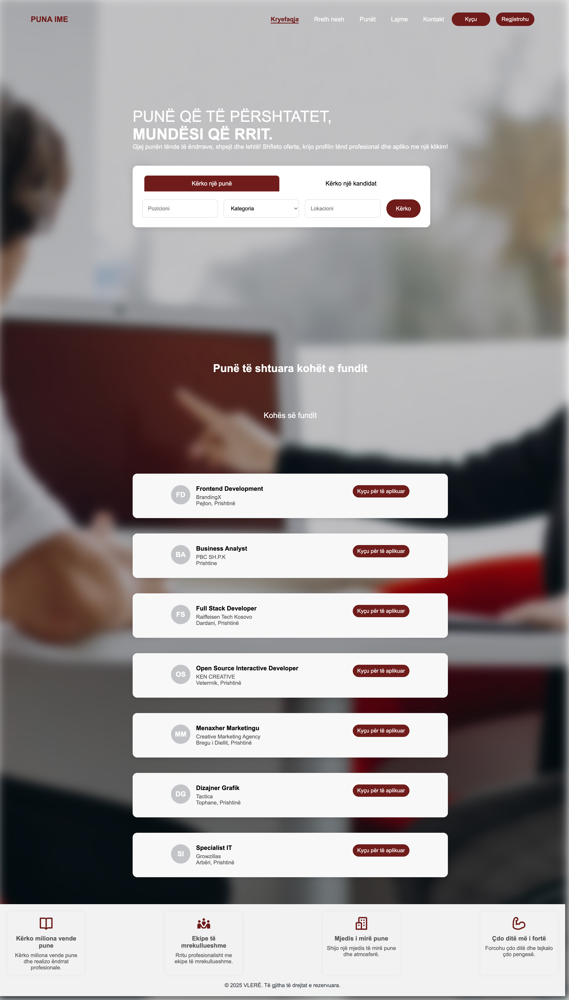
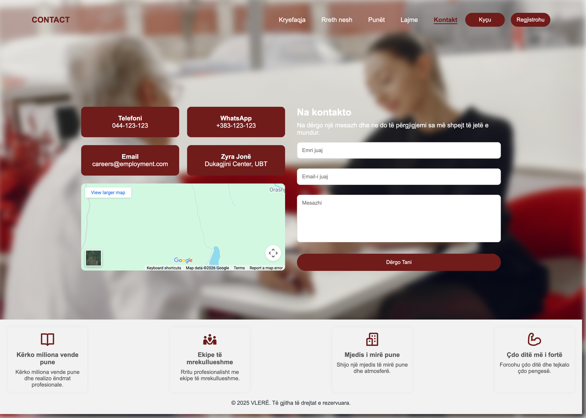
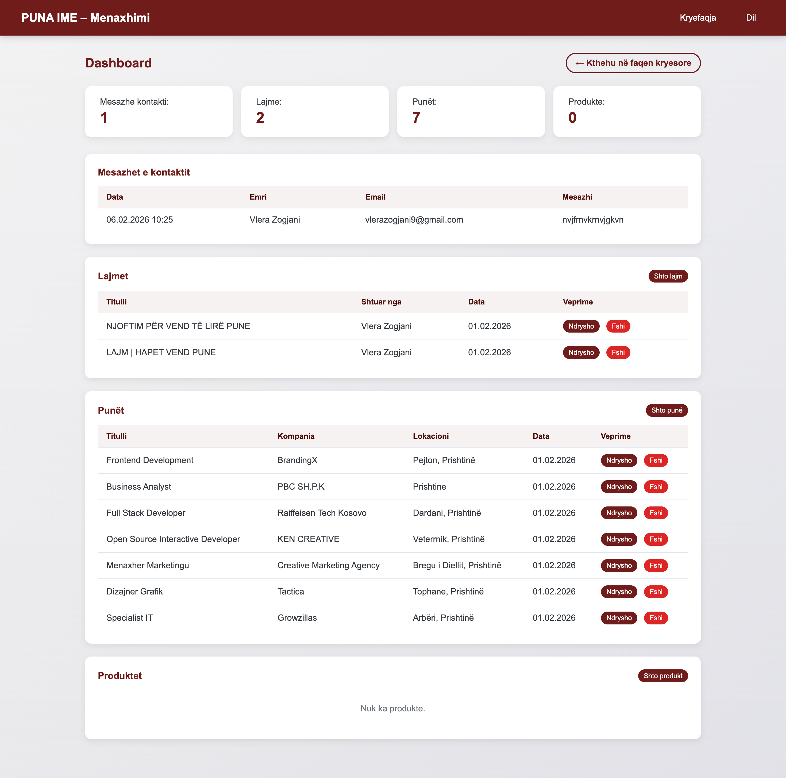

# PUNA IME – Projekti

Puna Ime është një aplikacion web i zhvilluar në PHP, që shërben si platformë për shpallje punësh. Aplikacioni përfshin kryefaqe publike, lajme, produkte, oferta pune, formë kontakti dhe një panel administrimi për menaxhimin e përmbajtjes.
---

## Struktura e projektit

Projekti/
├── admin/                    # Panel administrimi (akses vetëm për admin)
│   ├── dashboard.php         # Paneli kryesor (mesazhe, lajme, produkte, punë)
│   ├── add_news.php          # Shtim lajmi (imazh + PDF)
│   ├── edit_news.php         # Ndryshim lajmi
│   ├── delete_news.php       # Fshirje lajmi
│   ├── add_product.php       # Shtim produkti (imazh + PDF)
│   ├── edit_product.php     # Ndryshim produkti
│   ├── delete_product.php   # Fshirje produkti
│   ├── add_job.php           # Shtim ofertë pune
│   ├── edit_job.php          # Ndryshim ofertë pune
│   └── delete_job.php        # Fshirje ofertë pune
│
├── assets/
│   ├── css/                  # Stilet CSS
│   ├── images/               # Imazhe statike (logo, foto, etj.)
│   └── js/                   # JavaScript (slider, validime, etj.)
│
├── auth/
│   ├── loginform.php         # Forma e hyrjes
│   ├── registerform.php      # Forma e regjistrimit
│   └── logout.php            # Dalje nga llogaria
│
├── classes/                  # Modele dhe logjikë e aplikacionit
│   ├── Database.php          # Lidhja me MySQL (PDO)
│   ├── User.php              # Menaxhimi i përdoruesve
│   ├── Contact.php           # Mesazhet e kontaktit
│   ├── News.php              # Lajmet
│   ├── Product.php           # Produktet
│   ├── Job.php               # Ofertat e punës
│   ├── Slider.php            # Slider-i i kryefaqes
│   ├── SiteContent.php       # Tekstet statike (slogan, about, etj.)
│   ├── TeamMember.php        # Anëtarët e ekipit
│   └── Validator.php         # Validimi i të dhënave
│
├── config/
│   └── database.php          # Konfigurimi i bazës së të dhënave
│
├── includes/
│   └── auth_check.php        # Kontroll i autentifikimit për admin
│
├── uploads/                  # Skedarë të ngarkuar
│   ├── news/                 # Imazhe & PDF për lajme
│   ├── products/             # Imazhe & PDF për produkte
│   └── slider/               # Imazhe për slider
│
├── index.php                 # Kryefaqja
├── about.php                 # Rreth nesh
├── contact.php               # Forma e kontaktit
├── news.php                  # Lista e lajmeve
├── products.php              # Lista e produkteve
├── jobs.php                  # Lista e ofertave të punës
│
├── schema.sql                # Skema e bazës së të dhënave
└── hash.php                  # Skript ndihmës për hash të fjalëkalimeve

---

### Kërkesat
- PHP 7.4+ (me shtesë: PDO MySQL, `finfo` për MIME)
- MySQL/MariaDB (p.sh. XAMPP)
- Server web (Apache me mod_rewrite nëse përdoret, ose PHP built-in)

### Instalimi
1. Vendos projektin në `htdocs` (XAMPP) ose në dokument root të serverit.
2. Krijo bazën e të dhënave (p.sh. `projekti`) dhe ekzekuto `schema.sql` për të krijuar tabelat dhe të dhënat fillestare.
3. Në `config/database.php` përshtat: `$host`, `$db_name`, `$username`, `$password`.
4. Sigurohu që dosja `uploads/` dhe nëndosjet `uploads/news/`, `uploads/products/`, `uploads/slider/` ekzistojnë dhe janë të shkrueshme (p.sh. `chmod 755` ose 775).

### Faqet (pamjet) e aplikacionit
| Faqja        | Skedari       | Përshkrimi i shkurtër                    |
|-------------|----------------|------------------------------------------|
| Kryefaqja   | `index.php`    | Slider, slogan, kërkim punësh, listë ofertash |
| Rreth nesh  | `about.php`    | Tekst + anëtarët e ekipit                |
| Kontakt     | `contact.php`  | Forma e dërgesës së mesazheve            |
| Lajme       | `news.php`     | Lista e lajmeve me imazh/PDF              |
| Produkte    | `products.php` | Lista e produkteve me imazh/PDF          |
| Punët       | `jobs.php`     | Lista e ofertave të punës                 |
| Hyrje       | `auth/loginform.php`   | Login                                  |
| Regjistrim  | `auth/registerform.php`| Regjistrim i përdoruesve          |
| Admin       | `admin/dashboard.php`  | Paneli (pas login si admin)      |

### Baza e të dhënave
-Tabela kryesore:

-users
-contact_messages
-products
-news
-slider
-site_content
-team_members
-jobs

-Përshkrimi i plotë i tabelave dhe relacioneve gjendet në schema.sql.
---

Kryefaqja / Homepage

Rresh nesh / About Us

Punët e shtuara / Jobs

Lajmet e fundit / News

Kontakti / Contact Us

Kyçu / Log in

Regjistrohu / Register

Faqja Menaxhuese / Dashboard

